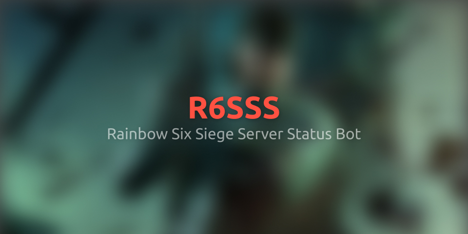

<h1>R6SSS Discord Bot</h1>

Rainbow Six Siege Server Status Bot

---

> [**日本語 / Japanese**](./README-ja.md) | **英語 / English**

This is a bot that sends Rainbow Six Siege server status to Discord text channels.

You can also create server status messages that update periodically.

---

### [**[Invite Bot to Server]**](https://discord.com/oauth2/authorize?client_id=990497421488451615)

### Operational Status

### Support Discord Server

### Bots on other platforms

Automatically posts when there is a change in status, such as the start of maintenance.

[![Twitter](https://img.shields.io/badge/@R6SSS__JP-blue?style=for-the-badge&label=Twitter&labelColor=gray&logo=data:image/svg%2bxml;base64,PD94bWwgdmVyc2lvbj0iMS4wIiBlbmNvZGluZz0iVVRGLTgiPz4KPHN2ZyB4bWxucz0iaHR0cDovL3d3dy53My5vcmcvMjAwMC9zdmciIHhtbDpzcGFjZT0icHJlc2VydmUiIHZpZXdCb3g9IjAgMCAyNDggMjA0Ij4KICA8cGF0aCBmaWxsPSIjMWQ5YmYwIiBkPSJNMjIxLjk1IDUxLjI5Yy4xNSAyLjE3LjE1IDQuMzQuMTUgNi41MyAwIDY2LjczLTUwLjggMTQzLjY5LTE0My42OSAxNDMuNjl2LS4wNGMtMjcuNDQuMDQtNTQuMzEtNy44Mi03Ny40MS0yMi42NCAzLjk5LjQ4IDggLjcyIDEyLjAyLjczIDIyLjc0LjAyIDQ0LjgzLTcuNjEgNjIuNzItMjEuNjYtMjEuNjEtLjQxLTQwLjU2LTE0LjUtNDcuMTgtMzUuMDcgNy41NyAxLjQ2IDE1LjM3IDEuMTYgMjIuOC0uODctMjMuNTYtNC43Ni00MC41MS0yNS40Ni00MC41MS00OS41di0uNjRjNy4wMiAzLjkxIDE0Ljg4IDYuMDggMjIuOTIgNi4zMkMxMS41OCA2My4zMSA0Ljc0IDMzLjc5IDE4LjE0IDEwLjcxYzI1LjY0IDMxLjU1IDYzLjQ3IDUwLjczIDEwNC4wOCA1Mi43Ni00LjA3LTE3LjU0IDEuNDktMzUuOTIgMTQuNjEtNDguMjUgMjAuMzQtMTkuMTIgNTIuMzMtMTguMTQgNzEuNDUgMi4xOSAxMS4zMS0yLjIzIDIyLjE1LTYuMzggMzIuMDctMTIuMjYtMy43NyAxMS42OS0xMS42NiAyMS42Mi0yMi4yIDI3LjkzIDEwLjAxLTEuMTggMTkuNzktMy44NiAyOS03Ljk1LTYuNzggMTAuMTYtMTUuMzIgMTkuMDEtMjUuMiAyNi4xNnoiLz4KPC9zdmc+)
](https://twitter.com/R6SSS_JP)

## Commands

- `about`
  - Sends information about this Bot.

- `ping`
  - Sends this Bot's latency.

- `status`
  - Sends the current server status. (Does not update automatically)

- `schedule`
  - Sends the current maintenance schedule. (Does not update automatically)

### Admin Commands
These commands can only be executed by users with administrator privileges on the server.

- `create [text_channel]`
  - Creates a server status message in the specified text channel that **automatically updates when the status changes**.
	- The sent server status will continue to be updated until **the message is deleted** or **a new server status is created with the `create` command**.
	- If `[text_channel]` is not specified, it will be created in the channel where the command was executed.

- `viewsettings`
  - Displays the current settings.

- `setindicator <enable/disable>`
  - Sets whether to display the server status indicator (emoji) at the beginning of the text channel name.

- `setlanguage <language>`
  - Sets the display language for server status.
  - Available languages:
	- 日本語 / Japanese
	- 英語 / English

- `setscheduledisplay <enable/disable>`
  - Sets whether to display the maintenance schedule in the server status message.

- `setnotification <enable/disable> [text_channel] [role] [auto_delete]`
  - Sets notifications to be sent when the server status changes.
	- If `[text_channel]` is not specified, it is set to send to the channel where the command was executed.
	- If `[role]` is specified, the specified role will be mentioned when the notification message is sent.
	- If `[auto_delete]` is specified, the notification message will be automatically deleted after the specified time elapses.
	  - Setting `[auto_delete]` to `0` seconds disables it. (Default value is `10` seconds.)
  > Notification Example
  >
  > 

## [Open Source License](./OSS.md)

## Terms of Service / Privacy Policy
- [Terms of Service](./TERMS-OF-SERVICE.md)
- [Privacy Policy](./PRIVACY-POLICY.md)

---

Copyright (C) 2026 Milkeyyy
